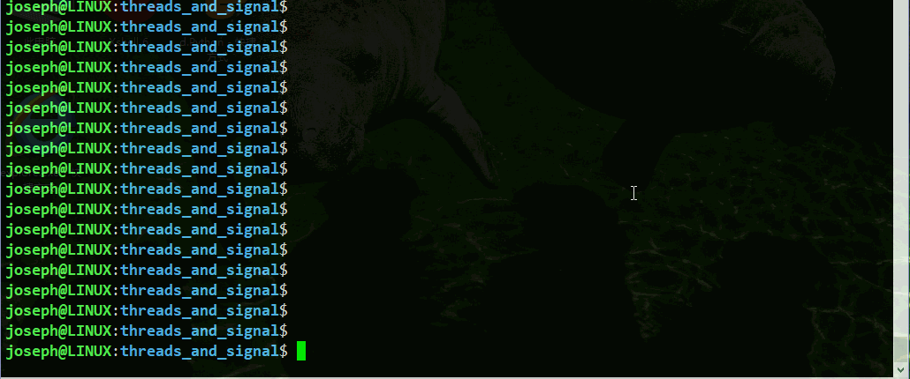

# Use Threads and Signal make unhang program

*keywords: Threads; signal; hang; Python; Ctrl+C; SIGINT*


## Change Log

### `SIGINT_Ctrl+C.py`

##### Usage

```shell
$ chmod +x ./SIGINT_Ctrl+C.py
$ 
$ ./SIGINT_Ctrl+C.py
......
Ctrl+C
.....
$ 
```

##### Test result




### `SIGALRM_calculate-game.py`

#### Usage

```shell
$ chmod +x ./SIGALRM_calculate-game.py
$ 
$ ./SIGALRM_calculate-game.py 
[Debug] prog_pid <- os.getpid(): 28202
!!!!!game start!!!!!
Calculate 10 x 4 = ?: 40
Right!

Calculate 8 x 6 = ?: 48
Right!

Calculate 6 x 5 = ?: 
Oooooops game time up!

Final score: 2

$ 
```

#### Test Result


### `unhang_console_by_Threads_SIGALRM.py`

#### Usage

```shell
$ pyton -c "import requests"
## run "pip3 install --user requests" if needed
$ 
$ time ./unhang_console_by_Threads_SIGALRM.py 
```

#### Test Result

- normal coding = console hang example:

```shell
$ pyton -c "import requests"
## run "pip install --user requests" if needed
$ 
$ time ./unhang_console_by_Threads_SIGALRM.py 
[Debug] prog_pid <- os.getpid(): 28334
{'https://www.baidu.com': True, 'https://www.bing.com': True, 'https://www.yahoo.com': True, 'http://www.so.com': True}
processing... \^C

real    0m17.423s
user    0m0.268s
sys	    0m0.026s
$ 
```


- use Thread, but main-thread wait sub-thread finish, then show the result, still console hang.

  ```shell
  $ git diff
  [...]
  --- a/unhang/threads_and_signal/unhang_console_by_Threads_SIGALRM.py
  +++ b/unhang/threads_and_signal/unhang_console_by_Threads_SIGALRM.py
  @@ -19,6 +19,7 @@ import os
   import signal
   # from random import randint
   from time import sleep
  +import threading
   
   
   request_pages_result = {}
  @@ -72,8 +73,11 @@ def main():
   
       # signal.alarm(5)
   
  -    request_pages()
  -    print(request_pages_result)
  +    t = threading.Thread(target=request_pages)
  +    t.setDaemon(True)
  +    t.start()
  +    t.join()
  +    print("request pages result: \n", request_pages_result)
   
       i = 0
       circle = ('|', '/', '-', '\\')
  $
  ```

  run `$ time ./unhang_console_by_Threads_SIGALRM.py` just look like the same.

- use threads, no `.join()` , catch "Ctrl+C" before quit program, show the result. 

  so, if run time is short, the function will not finish (`t.setDaemon(True)` must require). we can see different result if "processing" time is short and long.

  

- use threads with signal, unhang console.

  


### `unhang_GUI_by_Threads.py`

#### Usage

```shell
$ python -c "import tkinter"
## "pip3 install --user tkinter" if needed
## "requests" is also needed in this example
$ 
$ python ./unhang_GUI_by_Threads.py

```

#### Test Result

- basic GUI demo

  click button, show message on GUI.

  

- GUI hang demo

  Note: this run on Windows system, the phenomenon of hang can't be able to reproduce on Ubuntu.

  

- GUI unhang by threads demo

  


