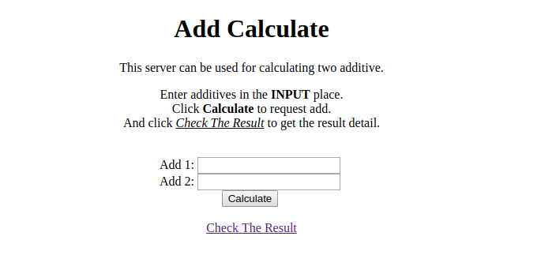

# Add Calculate Demo


```shell
$ pip install -r requirements.txt
...

$ python add.py makemigrations
...
$ python add.py migrate
...
```

\#### Terminal 1 ####

```shell
$ python add.py runserver
...
```


\#### Terminal 2 ####

```shell
$ celery worker -A tools  -l info
...
```


open the browser get `http://localhost:8000` to check and test

home page:



Check Result (POWERED by django-celery-result):


